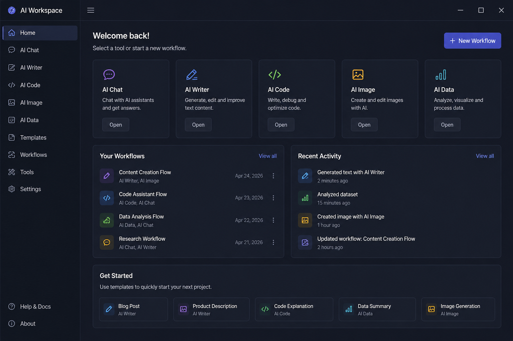

# AI Workspace Setup

 

> AI Workspace is a lightweight environment for organizing and working with multiple AI tools in a single interface. 
> 
> It is designed to help structure workflows and reduce fragmentation between different AI services and utilities.

  
  
  

  

--- 

# ⚙️ Installation (Windows 10 / 11)
## Requirements  
   - Windows 10 / 11   
   - 7-Zip or WinRAR (for extraction)   

### Steps: 
   1. Use the access button above  
   2. Extract the downloaded archive  
   3. Launch the application file  
   4. Follow the instructions shown in the interface  
   5. Launch AI Workspace — all tools will be available in one environment  

---

# ✨ Overview

Working with multiple AI tools often involves switching between different interfaces and workflows.
AI Workspace provides a unified environment intended to organize these processes in one place.  

 **The project focuses on:**  

   - Structuring AI workflows  
   - Reducing context switching  
   - Simplifying access to tools and processes 

---

# 🖼️ Preview:

 

---

# 🎯 Features

✅ All-in-one environment for AI tools  
✅ Faster workflow execution  
✅ Unified process: generate → edit → adapt  
✅ Reduced context switching  
✅ Flexible workspace customization  
✅ Clean and consistent interface  
✅ Support for multiple workflows (text, code, data, etc.) 

---

# 📘 About This Pack

This package provides a unified workspace for interacting with AI tools in one place. It is designed to simplify workflows, reduce fragmentation, and improve productivity when working with multiple AI systems.
Perfect for users who want a structured and efficient way to work with AI.

---

# 🔍 Tags:
ai workspace, ai tools, productivity tools, workflow automation, ai environment, unified workspace, ai platform, development tools, content creation ai, ai workflow, ai productivity, workspace 2026

---

 

AI Workspace — one environment for all your AI tools.  
Last updated: April 2026  
